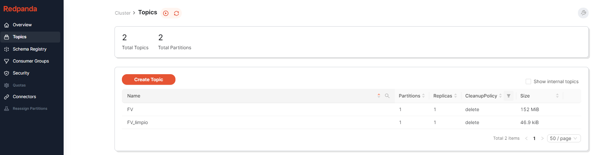

## Docker Stacks

Creamos primero la imagen del cluster de Apache Spark:
```
docker build -t cluster-apache-spark:3.2.1 .
```

Componemos el docker:
```
docker compose up -d
```

### 1. Kafka

Creamos un topic de kafka llamado FV
```
docker exec -it redpanda rpk topic create FV
```

Accedemos por consola al contenedor Kafka:
```
docker exec -it redpanda /bin/bash 
```

Y ejecutamos dentro del contenedor el siguiente comando para añadir al topic FV el siguiente json:
```
rpk topic produce FV < /tmp/data/FV.json
```

Una vez cargado el fichero podeis consultar los datos en la siguiente URL:

```
http://localhost:8080/topics/FV
```

### 2. Spark

Ejecutamos la query:
```
docker exec -it spark-master python3 /opt/spark-apps/GroupbyDate.py
```

En la siguiente URL podeis consultar los trabajos realizados

```
http://localhost:9095
```

### 3. Pipeline

Creamos un nuevo topic de Kafka:
```
docker exec -it redpanda rpk topic create FV_limpio
```

```
docker exec -it spark-master python3 /opt/spark-apps/Pipeline.py
```

Si volvemos a entrar a la consola de Kafka, podremos ver como se ha creado un nuevo topic agrupado por fecha


